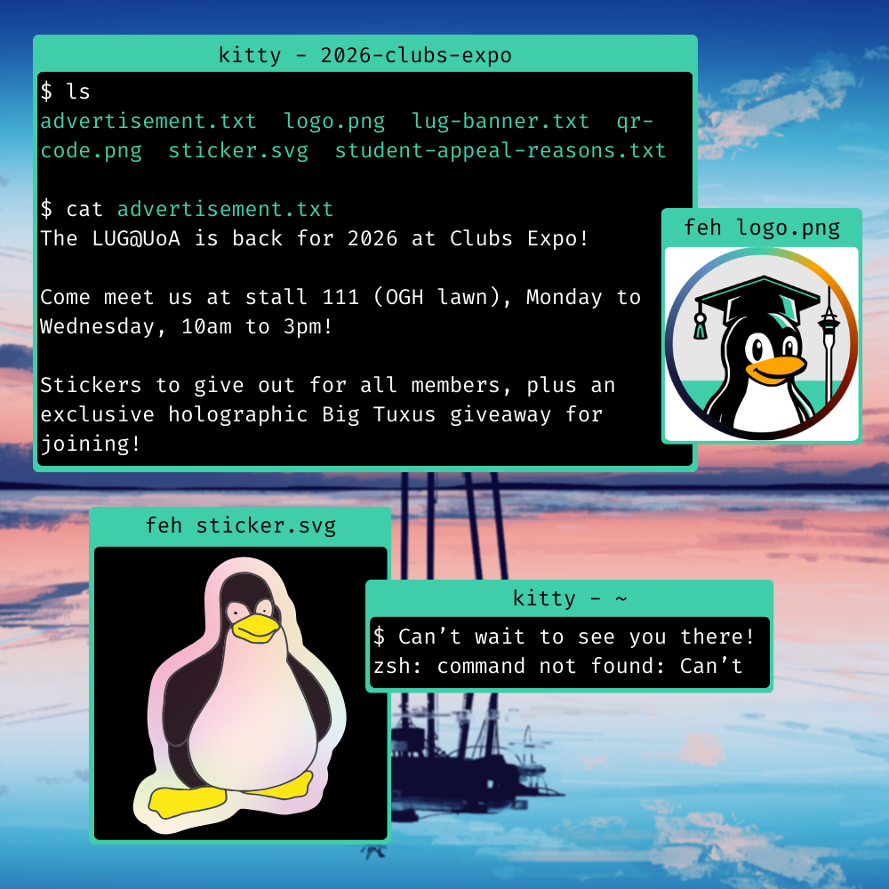
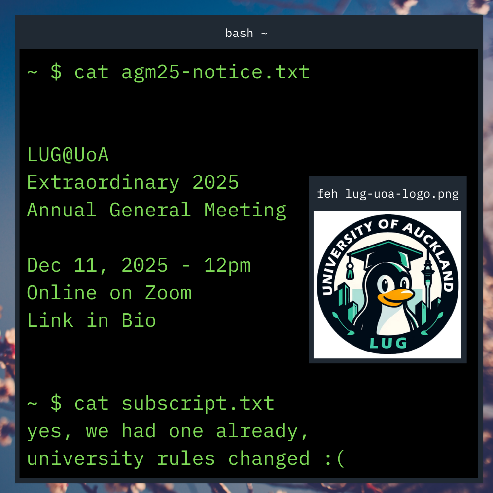
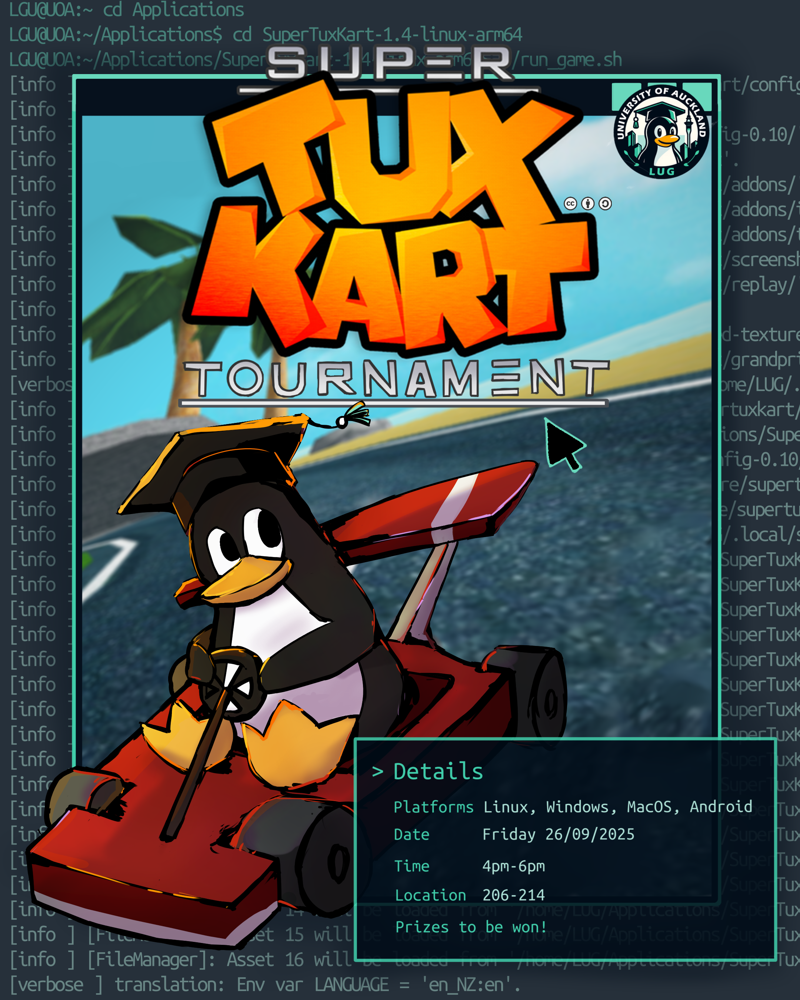

# Branding toolkit

In this repository, the recommended colours, fonts, and other imagery (logos), is present, as well as ways to use them.

## Contents
- Logos and Imagery
  - Emblem and the badge
  - Wordmark
- Fonts
- Colours
  - Light theme (default)
  - Dark theme
  - Extras
- Examples
  - Instagram posts
  - Custom ideas
- Notes on specific files
  - `emblem-colourful.svg`

## Logos and Imagery

### Emblem and the badge

The version of the logo without the surrounding text is known as the 'emblem', whilst the version of the logo with the surrounding 'Linux User Group' 'University of Auckland' text is known as the badge.

| *Emblem* | *Badge* |
|-|-|
|  |  |

The badge should only be used when the text is sufficiently large enough to make the text visible. Otherwise, the wordmark should be used.

If no text is needed, the emblem can be used.

### Wordmark

**Full wordmark:** 'University of Auckland' Fira Mono, regular weight 30pt w/ -10% letter spacing. 'Linux User Group' Lato, black weight, 36pt


**Abbreviated wordmark:** Lato, black weight, 48pt


The emblem should be at least 16px away from the text. The emblem can either be on the left or right of the text (just make sure to align the text accordingly)

## Fonts

Sans-serif: `Lato`

Monospace: `Fira Code`

Any serif font is acceptable.

We use sans-serif for paragraph text, and monospace for code and other graphics which require monospace fonts. Headings and titles can use either sans-serif, serif, or monospace fonts, but usage must be consistent throughout the design.

> Any fonts which look similar are fine, just ensure that the number of different fonts on a design is low.

## Colours

> Accents are nice to add colour, but should not be excessively used. See examples for good usage.

### Light theme

| Background | Content | Alternative Background | Accent |
|-|-|-|-|
| `#FFFFFF` | `#000000` | `#90ccbd` | `#3fcca8` |

> Alternative background: Accent - 40 Saturation
>
> `HSV(165, 69, 80)` -> `HSV(165, 29, 80)`


### Dark theme

| Background | Content | Alternative Background | Accent |
|-|-|-|-|
| `#000000` | `#FFFFFF` | `#1f6654` | `#3fcca8` |


> Alternative background: Accent - 40 Value
>
> `HSV(165, 69, 80)` -> `HSV(165, 69, 40)`


### Extras

We also have extra colours if required, but please ensure to keep theming consistent when used.

```
#FFA300 - Yellow
#E6E6E6 - Cream/off-white
#6290C3 - Light blue
#1A1B41 - Dark/navy blue
#881600 - Crimson
```

## Examples

### Instagram posts

We make these to represent Linux well, while still looking good for the algorithm; hence they stray a bit away from the guidelines, but they do have consistent theming while conveying information nicely.

Some creative liberties are taken, but posts generally tie into the theme of "being a Linux system screenshotted for the advertising".

Our instagram posts are made such that they simulate an actual system, and can be made (pretty closely) on a live running system, using common commands and apps. We eventually want to be able to build a system where we can generate these via a script and not manually on Canva (🥀).

> Note that the 2026 advertising ties closer to our overall theming goal.

#### Post notes

Note the below:
- Each post has terminals, which use the monospace font `Fira Code`
- Accents are used in the terminals to highlight important text, while (somewhat) remaining in-line with how the `ls` command works on Linux
- Our logo is prominently used. We use the colourful border when the name of the club is available elsewhere in the post, but we may also use the text border, or the wordmark in more professional settings.

**Clubs Expo 2026**



**Extraordinary Annual General Meeting 2025**




> Both images used in the background are from my (`parmjotsinghrobot`) private collection, and I am not sure on the legality of using these for commercial (or anything really), so I am looking for good options for future posts.

### Custom ideas

For our SuperTuxKart tournament, we had a club member draw a very nice poster (for free! how kind) for our socials.

It is to note that our (old) logo is still present, and the main theme of being about Linux is still present, as can be noted with the terminal output in the background. 

At this point in time, our accent colours weren't finalised, but we still did use the teal-ish colour at that point.

> *Fun fact: the output is simply SuperTuxKart being run in a terminal*



## Notes on specific files

### `emblem-colourful.svg`
Note that the colourful border might not render correctly in Inkscape and most image viewers (it will correctly render in most common browsers). If so, a PNG version is provided for use.
